# 《李斌之死》

> **作者**：MC 鲁迅（婚恋从业纪实作者）
> **副标题**：一个没有争吵的婚姻故事
> **素材来源**：一位离异老哥提供的自制视频
> **记录时间**：离婚前一整天的生活

---

## 卷首语

我经常在相亲交流会上播放一段视频。

那是位离异老哥自己录的，记录了他离婚前一整天的生活。

因为经典程度堪称艺术，我反复把它带到那些场合。每次播放结束，台下都会安静一会儿，然后有人叹气，有人笑，有人低下头。

今天，我想用文字直播给大家看。

算算我已经写了上千篇婚恋从业纪实文。我一直努力保证内容高质量的同时，努力追求每一篇都展示新的东西、新的视角。

这一篇，我想写点细节，写点生活化的视角，写点绕开很多典型矛盾后，婚姻平淡日子里暗藏的洪流。

你会发现这段视频里，没有剧烈的争吵，没有暴力的撕扯，没有歇斯底里，没有疯狂，也没有任何超越认知的抽象与抗争。

**那些有关精神之间的折磨，才是细小而可怕的刺。**

---

## 第一幕 · 早晨 7:45，摄像头开了

视频开头，是一个架在三脚架上的小型摄像机。镜头反光里隐约能看到房间的轮廓。摄像师本人刚刚架好设备，对了一下时间。

**早上 7:45。**

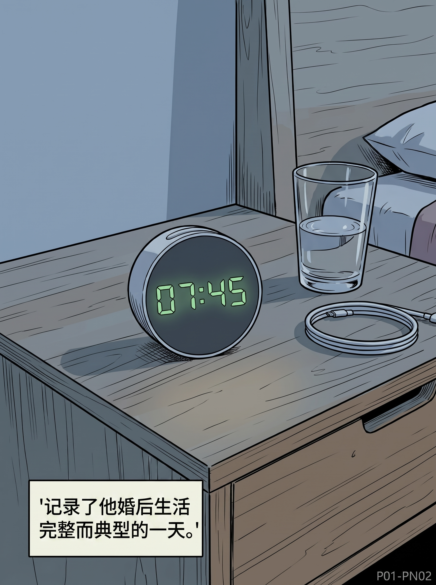

画面右下角是客卧门框的下半段，门关着，门缝里透出一线冷白晨光。

这是这个家的男主人——李斌——在我们镜头前躺下的最后一天。

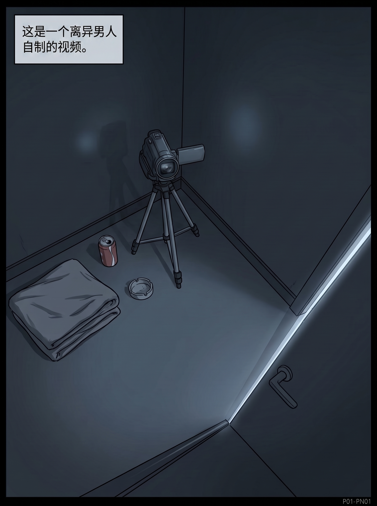

我们这位离异老哥，把录像机往客厅角落一支，转身回去睡了。

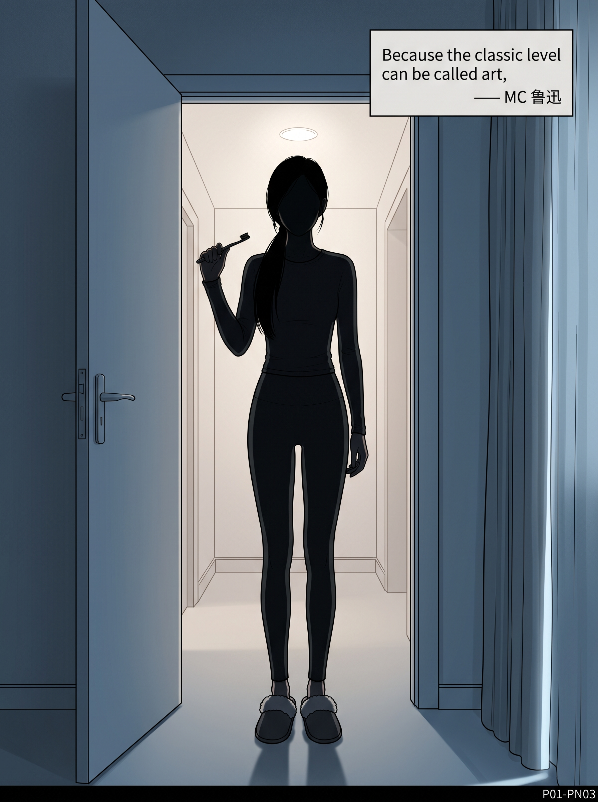

---

## 第二幕 · 妻子叫醒李斌的十二种方式

### 第一声

客卧门被轻轻推开。

是妻子。她手里握着电动牙刷，一脚迈进门槛，一脚还在走廊。她脊背挺得笔直，下巴微微抬起，眼睛已经锁定了床上那个人。

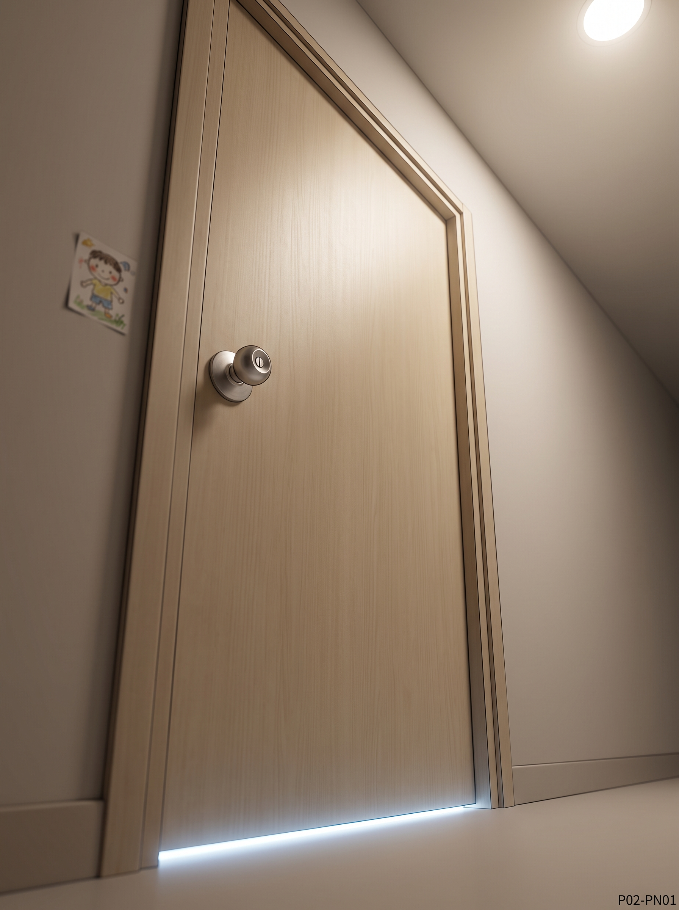

> **李斌，起来。**

被子里没有回应。

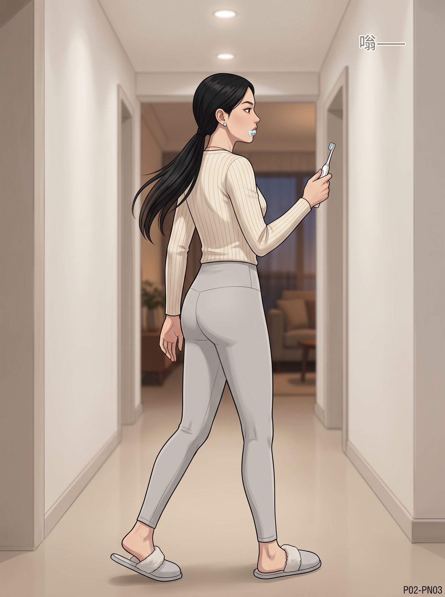

床上那张脸埋进枕头，眼完全闭上，眉心蹙起，嘴唇抿成一条线。一只手臂横搭在额头——挡光。

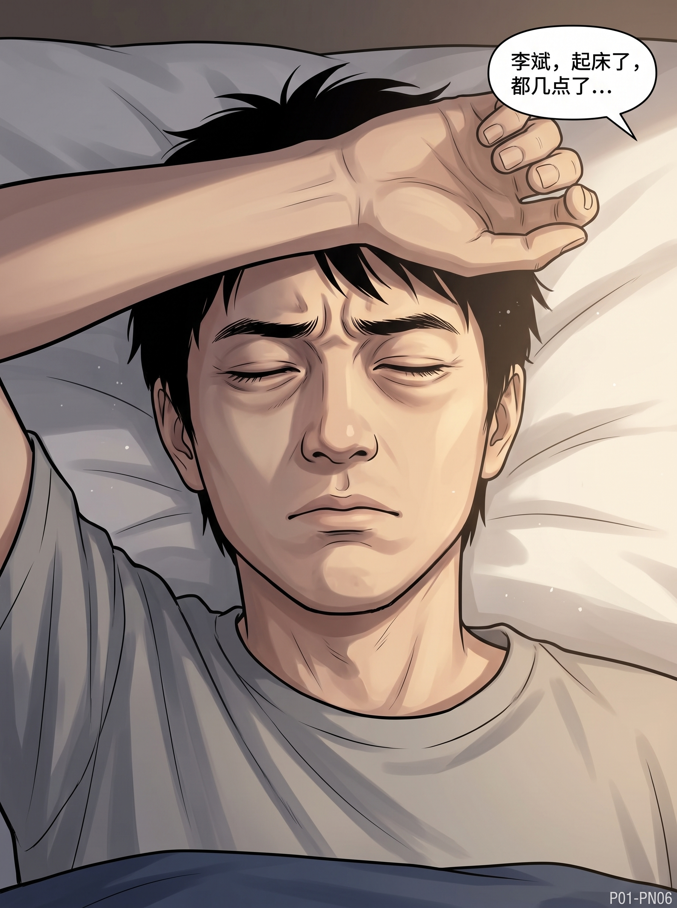

### 第二声

过了大约 30 秒。妻子走回来。牙刷已经放下，嘴已经空了。

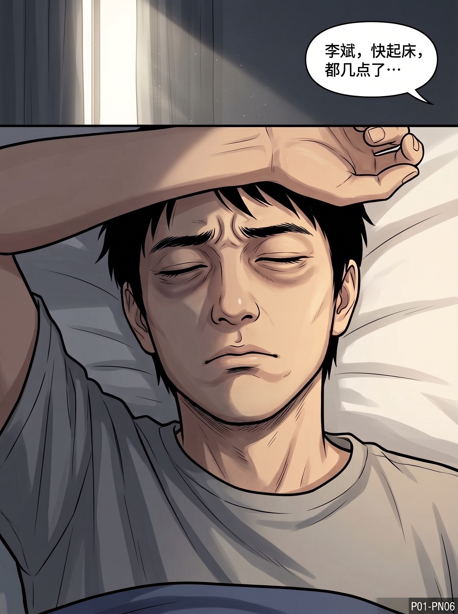

> **李斌，起来了，几点了……**

一只手叉到腰上。她没走。

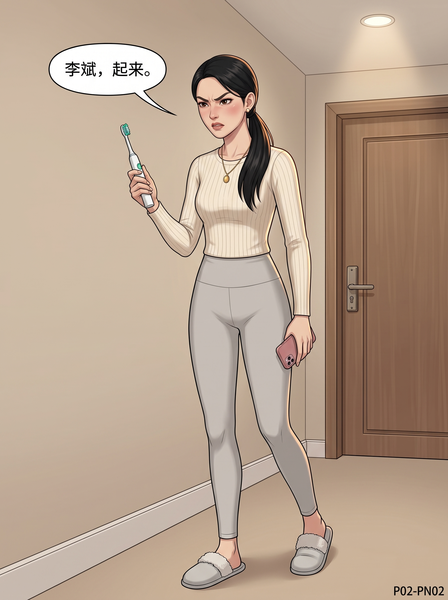

### 第三声

又过了一会儿。这次台词长了一些。

> **我不多说啊，你赶紧给我起来啊，这一天天忙的要死，我还有事儿呢。**

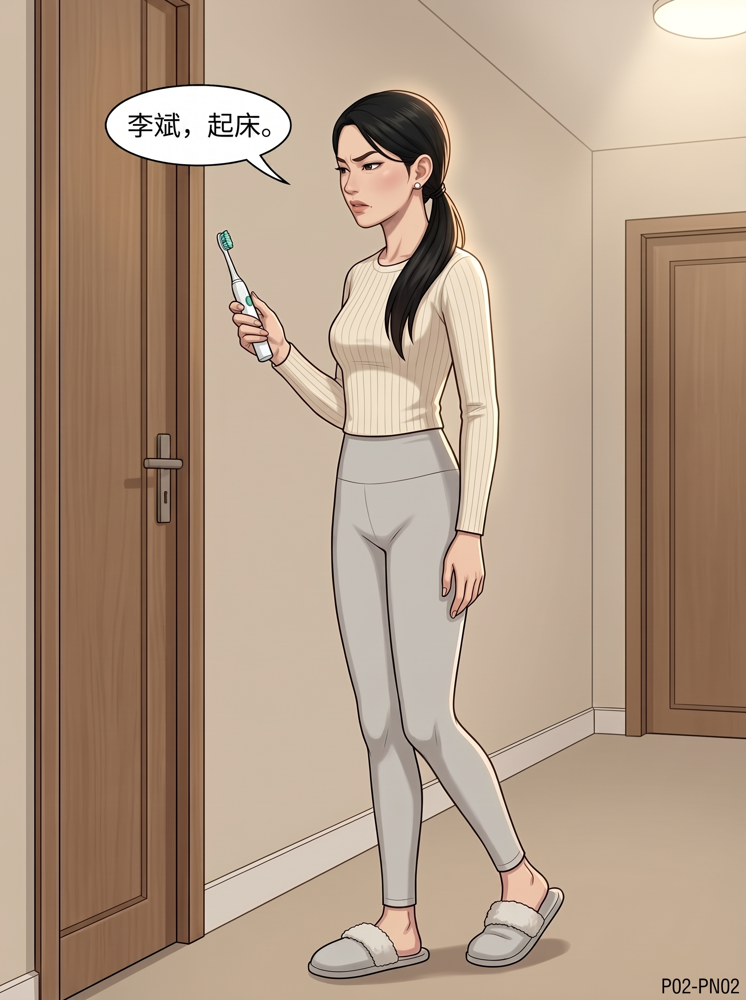

### 第四声

> **起来了，怎么还睡呢，起来起来。**

她以为走开了，没走几步又回来——头从肩膀方向转过来 30 度，回头望客卧门。一只手叉腰，另一只手扶在门框上。

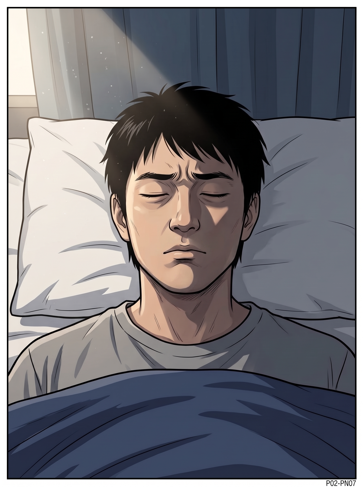

门外越来越急，屋内越来越沉。

**两侧的不对等，是这个家从这一天起所有故事的核心张力。**

### 撕帘

她径直冲进来，一把扯开窗帘。暖白光爆涌进来。

> **我跟你说话你当没听见是吧，看这屋里给你造的，这一股味儿啊。窗帘也不开，拖鞋也乱扔，真服了你了。**

> **行行行，你睡吧，你就这样睡，睡到 12 点，睡一天，睡一夜，我不管你了。**

她摔门出去。

### 数数

> **李斌，我数到三，你赶紧给我起来。**

> **对，你就装死吧，有种别起来。**

她开始在客厅有意制造巨大噪音。

---

## 第三幕 · 她没有走远

### 关空调，调大声电视

她进门直接关掉了客卧的空调，把客厅电视声音调至最大。

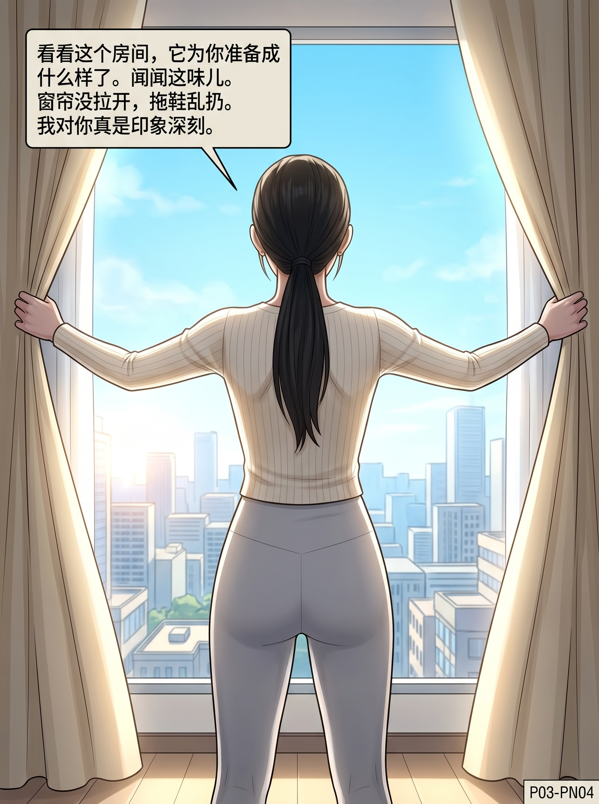

过了一会儿，她推开客卧的门框，这次口气稍微放软了一点：

> **哟，我以为你不起来呢，不再睡会儿吗。**

### 拉开窗帘后，李斌醒了

窗帘被扯开后，房间的色调从冷蓝灰变成了暖白偏黄。

> **今天是周六，你不知道吗？**

### 李斌第一次开口

> **什么周六周日啊，这是早睡早起，培养良好的生活习惯。人网上专家都说了。**

> **我昨天加班到夜里 4 点多，我很累了，我想多休息一会儿不行吗？**

> **睡啊，谁不让你休息啦？**

### 妻子的话

> **那你大早上吵我干嘛？**

> **首先我不知道你昨天晚上加班了，其次，就算加班了，咱能不能早上起来吃点早饭再睡？最后，你跟我说话什么态度啊？你凶我干嘛呀？**

### 李斌

> **我哪什么态度了，我不就是问了一句吗？**

### 妻子

> **我真是没事找事，还担心你的身体，还好心喊你起来吃早饭。你就适合一个人过，睡睡睡，往死了睡。从现在开始我不管你了好吧？别跟我说话了……我——再——重——复一遍，别跟我说话了，谢谢。**

她回卧室，但仿佛等待着什么。

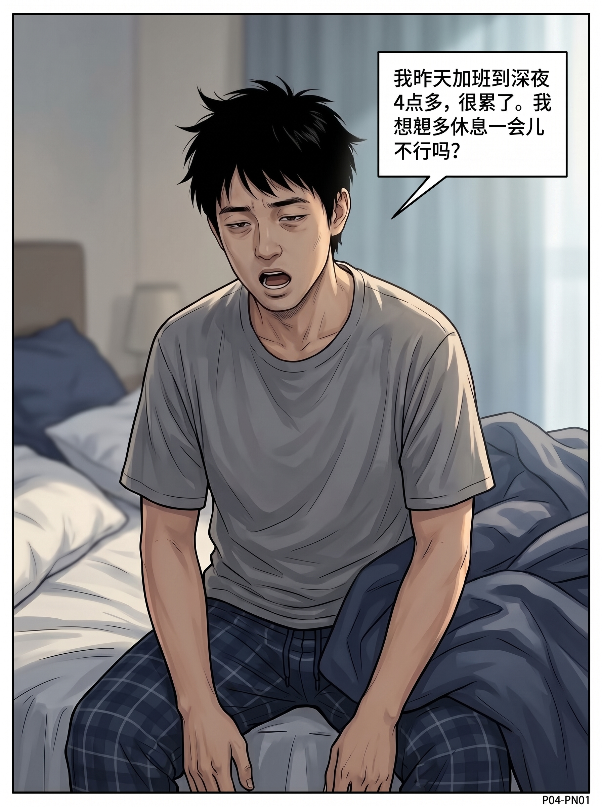

---

## 第四幕 · 她回来了，5 次

### 第 1 次

门再次被推开。

> **不是，李斌，我说你多少次？尿尿把那个马桶盖打开，或者坐在马桶上尿，又溅到马桶上，到处都是的。你来擦还是你来洗啊？**

被子蒙得更紧。

> **说话呀！把被子蒙着算什么事儿！**

> **……我等会儿清洗行了吧。**

### 第 2 次

> **这阳台花盆上不知道哪来一个烟头，不是你？……你知道的，我三令五申不能在家里抽烟……不是你抽的就行，最好不是。**

### 第 3 次

客厅的声音飘进来。

> **又吃泡面，又吃泡面。还耍心眼子，吃完包垃圾袋里扔门口，以为我看不到是吧？**

> **内裤袜子衣服又放在一起洗，说了多少遍手洗，手洗还放洗衣机洗，那耳朵要着干嘛的。**

> **算了，那也别让你手洗了，你就是那机洗的命。上次让你给我洗两条内裤，看洗成那什么鬼样子。**

### 第 4 次

> **快递码我发给你了，记得等会帮我拿个快递。我要出去一会儿。**

> **你是上街给妈买衣服不？**

> **买衣服？我妈衣服都给她买多到一天一换都穿不过来，下次还是给钱吧。哪里需要买什么衣服，莫名其妙的假孝心。**

> **不是说给我妈买几件换身衣服吗。**

> **……奥……你妈啊？什么时候说过要给你妈买衣服的，我怎么想不起来。**

> **上次给老人生日的时候说的。**

> **我叫的车到了，我不跟你多说了啊。桌上有早饭，你想吃就吃点。**

### 最后的嘱托

> **我去干嘛呀，啥都问。我上次不是跟你说了吗？跟我朋友团了一张瑜伽馆的年卡。**

> **多少钱哦。**

> **要不了多少钱，看你那样子，还"多少钱哦～"，可怕我花你点钱是吧。过生日人老公给我闺蜜送一个多重的那是大金镯子，你给我送什么了？转那点可怜的红包都犹豫半天，啧啧啧。**

> **不跟你说了，你帮我扣一下后面的扣子，这衣服我新买的，我还没穿呢。**

> **你帮我看下我脸上这个粉，现在过渡得怎么样？自然不自然。**

> **你赶快下去吧，人滴滴司机等你多长时间了？每次都这样。**

> **闭上你那个臭嘴吧，没让你开车送我，你还关心起滴滴司机了，你去跟他过吧。也没见你什么时候多关心关心我嘞！**

> **走了。**

关门声。

---

## 第五幕 · 上午 · 一个男人独处

随后视频开始陷入无声状态。

李斌再次躺下想睡一会儿，但大约十分钟后发现睡不着，便起身。

洗漱之后，他来到客厅，发现桌子上摆了一杯绿色米糊糊状的东西。他对镜头解释了一下，是流行的什么"羽衣甘蓝营养粉"。

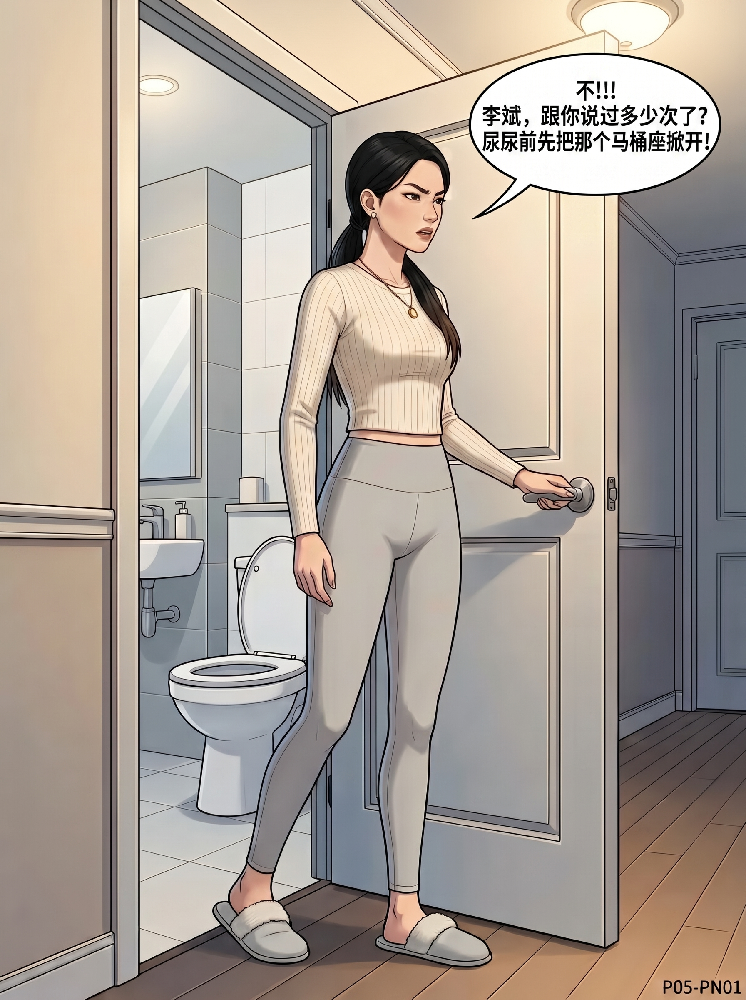

他沉默地看了一会儿，倒掉了。但不小心滴在了地板上，赶紧擦去，又去冰箱拿了一罐可乐喝。

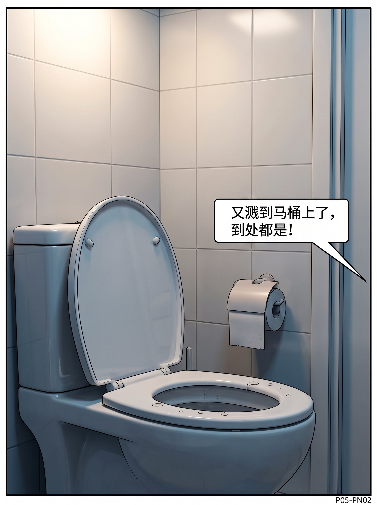

### 沉默

他开始坐在沙发上。

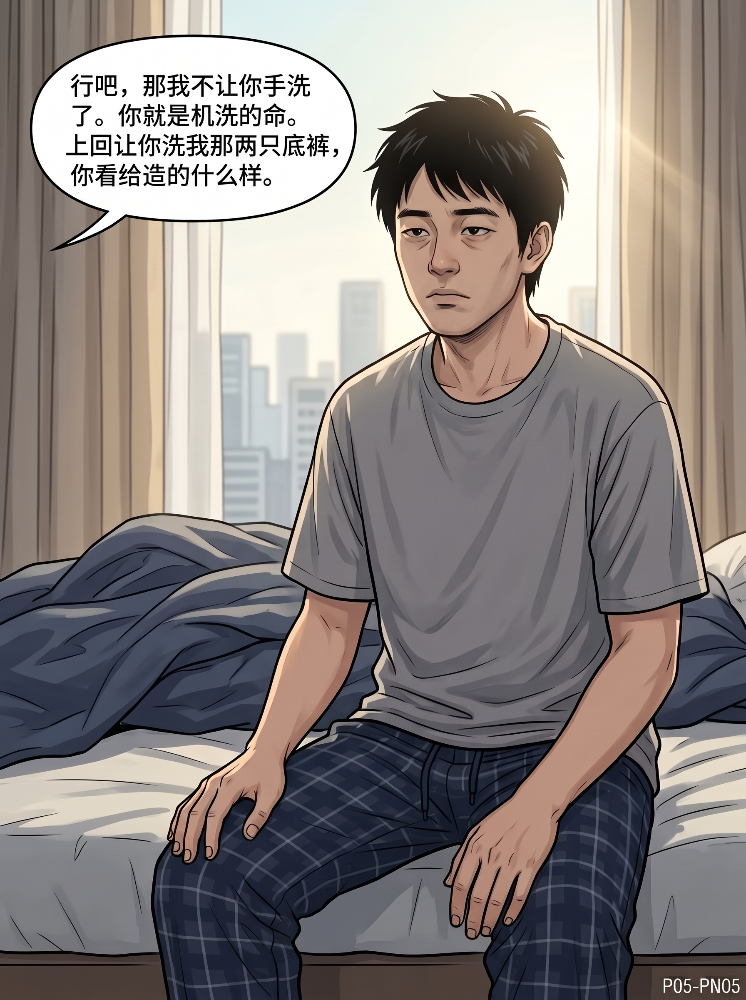

**持续沉默。**

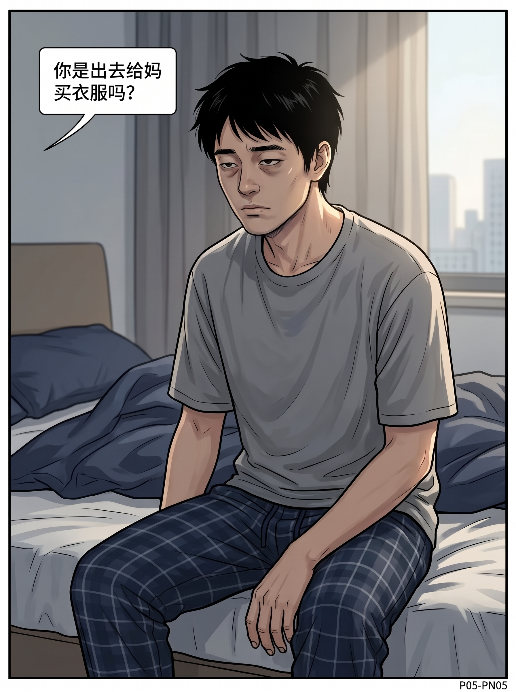

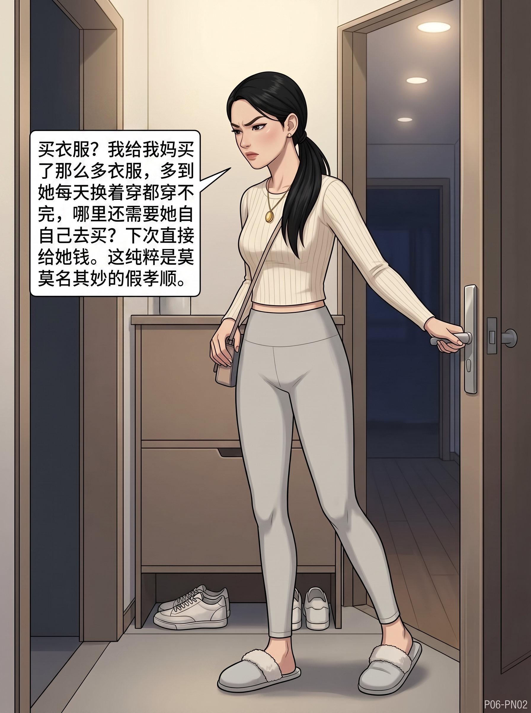

中间滴滴声响起，他拿起手机看了一下，发现是 QQ 邮箱的自动消息。他自嘲地笑了。

---

## 第六幕 · 假面骑士腰带

穿着睡衣下楼，过了一会儿提了外卖上来。一边吃一边看视频，偶尔发出笑声。

视频里是假面骑士的腰带变身集锦。

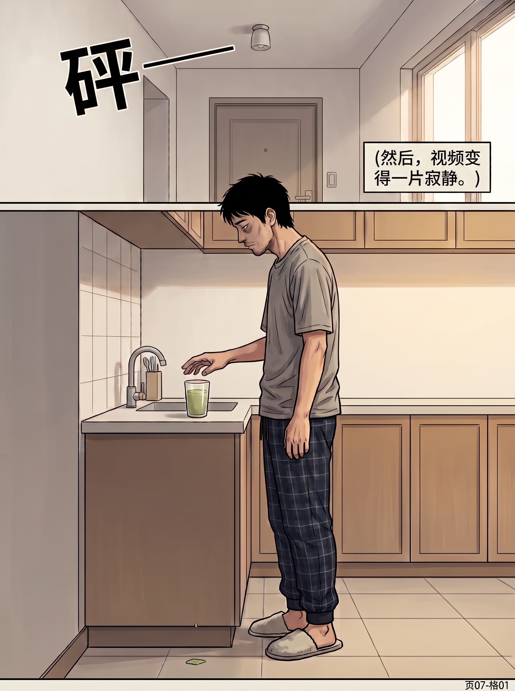

他看到兴起，跑进房间，拿出一个类似的腰带模仿着。可以看出，心情好了许多。

---

## 第七幕 · 电话来了

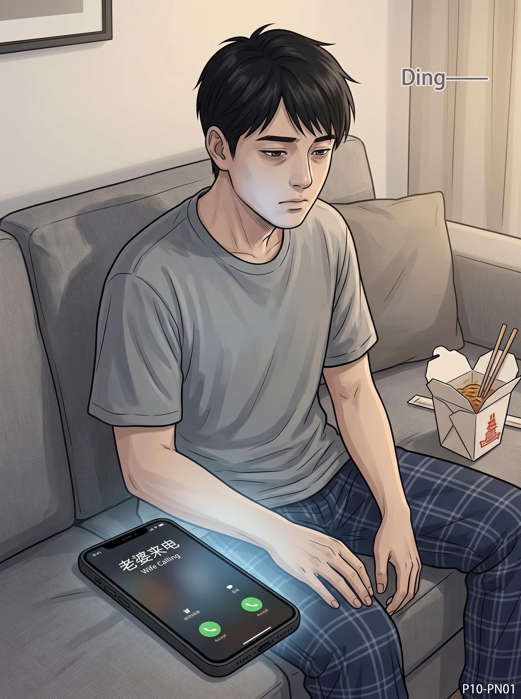

李斌坐在沙发上，手机屏幕朝上。来电显示「老婆」，绿色横幅亮起。

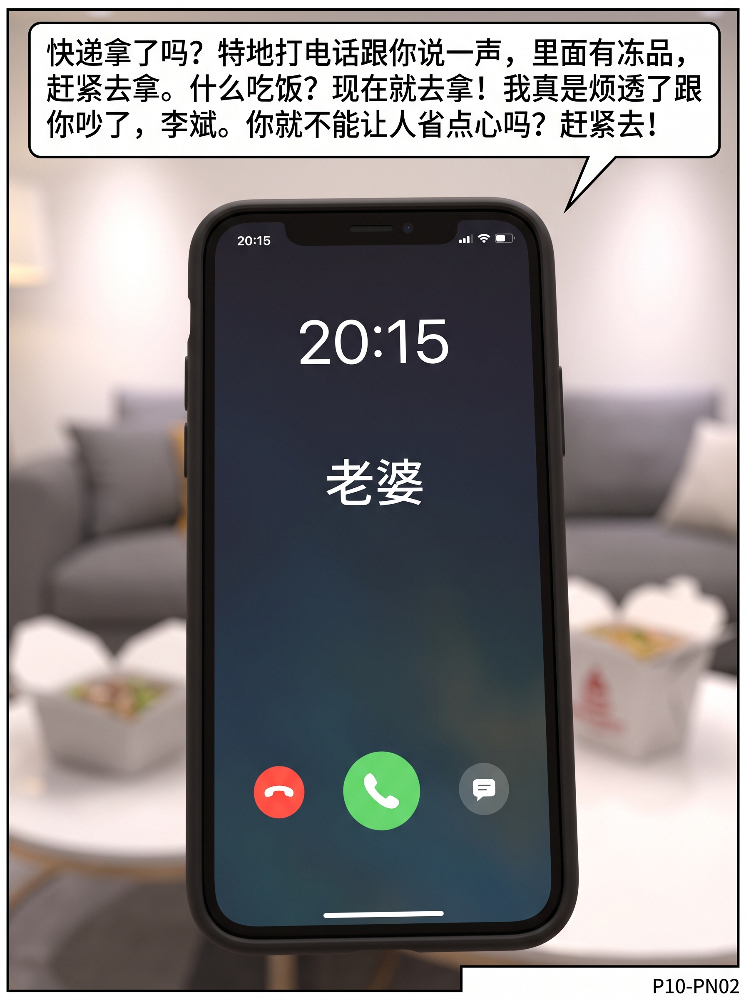

> **快递拿了吗？我特意打电话跟你说，那快递里面可是有冷冻的，赶紧去拿。什么在吃饭在吃饭的？你现在就去拿呀，我懒得说你了，李斌。你能不能长点心？快点，赶紧的。**

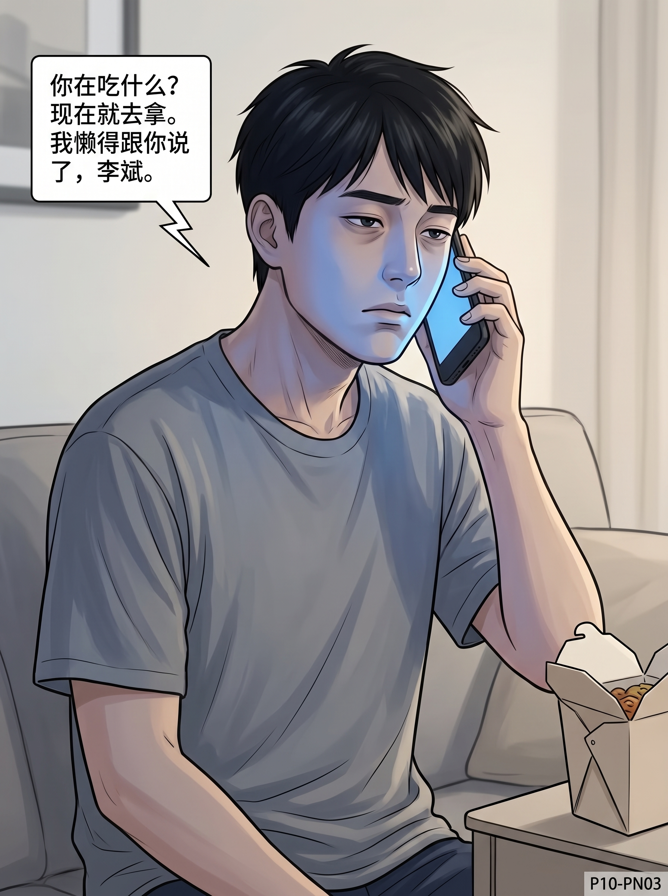

李斌把手机举到耳边，肩膀明显塌着。

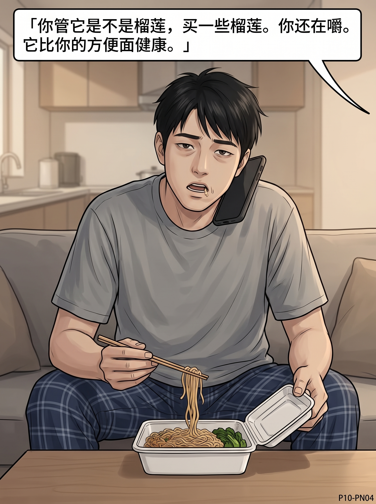

> **你管什么榴莲不榴莲的，买点榴莲，你还唧唧歪歪了，咋地比你泡面健康。**

---

## 第八幕 · 打扫卫生蒙太奇

快递拿回来后，李斌在沙发上干坐了一会儿，紧接着进入了打扫卫生中。

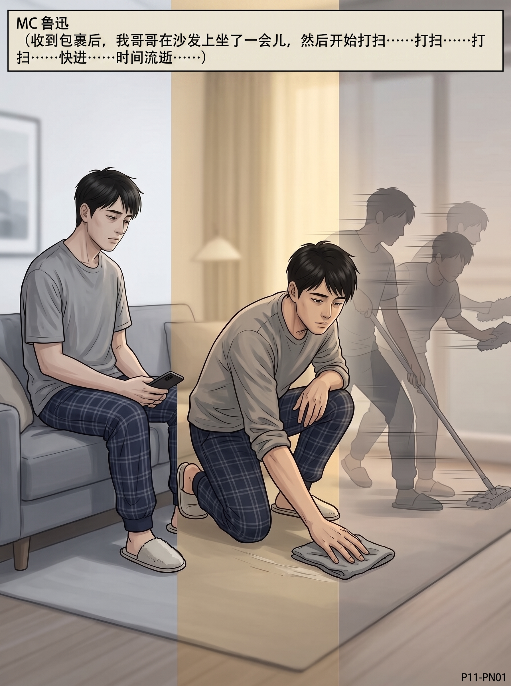

打扫卫生中……

打扫卫生加速快放……

时间流逝……

---

## 第九幕 · 晚上 8:15 · 她回来了

门被推开。

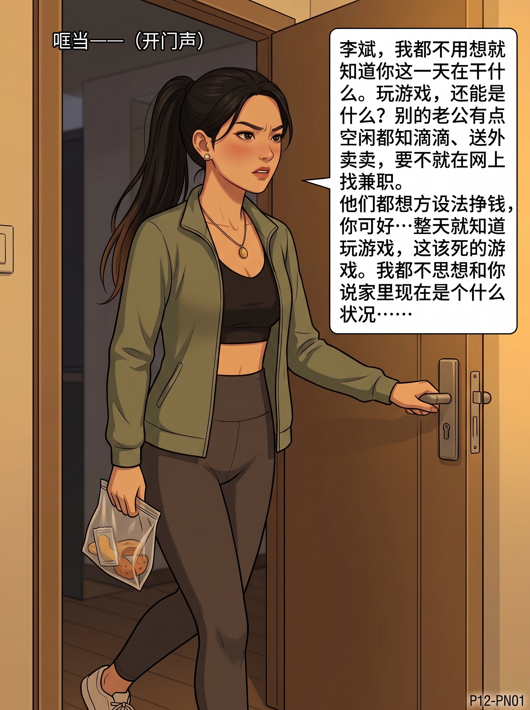

> **（边换鞋挂包边说）李斌，不用想我都知道你这一天又干嘛，打游戏，还能有什么事呦。人家老公有点空闲时间，都知道去跑跑滴滴，送外卖，再不济也知道网上找找兼职。都想法子钻研赚钱，你倒好……整天就是知道打游戏打游戏，钻他妈那游戏里面。那家里不用我说，肯定又是……**

她冲进主卧室——

> **哎呀……哎呀妈呀妈呀妈呀妈呀。**

冲进客卧——

> **哎呦呦，我的天老爷呀。**

> **卧室也没人呀。**

> **客卧也没有……**

返回客厅。

> **那一定是在窗帘后面，要不就是在阳台。**

> **不行，我得去找找，我看家里是不是真藏人了？**

> **不对劲，不对劲不对劲。**

> **啥情况啊，李斌。**

### 她终于发现

> **哎呦，脱皮喽改性喽，知道自己打扫卫生了。要不是现在天黑了呀，我真得去看看太阳是不是打西边出来了。**

李斌从头到尾一直坐在沙发上沉默。在妻子上前摆弄他的脑袋后，他抗拒出声。

> **不是，你有必要这样吗？**

> **我咋啦，我就是看看咱家大斌子今天怎么这么懂事了。不是，弄你两下你挡什么啊。你弄疼了我知道不，我刚做的美甲。**

> **你不是去瑜伽课了吗……**

> **去哪里还要一一跟你报备，你还成老板了是吧。**

> **不过，今天为了奖励你，你等会可以玩游戏，我绝对不扰你。**

> **真的？你说的啊。**

> **上哪儿去啊，让你玩你现在就等不喋是吧。跟你说个事，妈的，气死我了。**

---

## 第十幕 · 闺蜜、电话与新仇旧账

### 闺蜜事件

> **我是真看出来了，xx 就是一个贱人。之前就是我眼瞎，没看出她到底是什么货色。**

> **之前我就说了，少跟你这些朋友来往。你这些个闺蜜同事有几个……**

> **不是，哪里又轮得到你来说我朋友了。人家再不好，没招惹你好吗。**

> **……那你这朋友人其实还不错。**

> **不错，什么不错。你觉得她不错你就被这小贱人骗了，你不知道她背后做过多少恶心的事好吧。我是受够了。**

二人开始沉默地一同望向电视。

### "你对我朋友有意思？"

> **你说，你是不是对我朋友有意思？你有想法就说出来，我不怪你。**

> **这都什么跟什么啊。**

> **跟你开玩笑，你还当真了。你真有意思，人也看不上你，你是有钱还是有人，人能瞧得上你哪一块啊。娶到我，你算是烧高香了。**

> **……**

### 喝剩的奶茶、吃剩的零食

> **看我给你带了什么。噔噔噔噔！**

> **又是喝剩的奶茶，吃剩的零食是吧。**

> **哎呀，咋这么聪明呢。**

> **我去玩游戏了。**

> **去吧去吧去吧，别耽误我看剧了。对了，给我每个月几个会员都续上啊，最近我要看一部巨好看的剧，曾舜晞帅死了。**

李斌进卧室，妻子留在客厅看电视。

---

## 第十一幕 · 五次召唤

约 5 分钟后——

### 第 1 次

> **李斌，给我倒杯水。**

### 第 2 次

> **李斌快点快点，把榴莲拿出来。**

### 第 3 次

> **李斌，李斌！帮我指甲剪拿一下。**

> **不是，你什么眼神？我让你给我拿下东西怎么了。再给我拿一袋小饼干。**

### 第 4 次

> **李斌，你来看一下我腿上这红疙瘩是什么。我这里好难受，李斌？**

### 第 5、6、7 次

> **李斌——！**

> **李斌————！！！**

> **李斌你再这样，下次我不让你玩游戏了。**

> **李斌你再不出来，你那什么破玩具腰带，我马上给扔了。**

---

## 第十二幕 · 算账

### 李斌爆发

> **我们之前不是说好等会你看看剧，我自己玩会游戏吗。我昨天加班到半夜，今天又把家里卫生里里外外都打扫了，我怎么就不能玩玩游戏了。我每天工作也很辛苦的好吗？**

### 妻子的怨

> **就你上班累上班辛苦，谁上班不辛苦。人都说要不给女人钱，要不给她时间，要不给她自由。我倒好，啥都没捞着还惹一肚子气。**

> **你一直对我有意见，对不对？**

> **我对你有啥意见了？**

> **那昨天我问你那件事，你为什么不回答？**

> **哪件事，什么事？**

> **呵呵，自己想。我不想再重复了，好吧。**

两人再次陷入沉默。过会儿妻子推开客房门，坐在李斌电脑椅旁边。

---

## 第十三幕 · 生日

> **好了老公，咱们不闹了行吗。**

> **对——是——，我今天情绪有点不好了，也怪我那死教练。老是说别人这身材好，那身材好了，到我这就这难练出来那不好出效果，说什么天赋。**

> **老公，老公别生气了，我给你倒杯果汁好吧。你吃饭没？我给你点外卖。**

> **今天是我的生日你知道吗？**

> **…………啊？不是吧，我记得过两天啊。**

> **……**

> **我给你准备了生日礼物的好吧，只不过还没到而已。**

> **那你给我看看快递。**

> **别碰我手机！说了买了就是买了。**（持续控诉）**你还想抢我手机？你还想打我是吧？我不给你过生日你就打我是吧！**

控诉之后，家里再次陷入死寂。

---

## 第十四幕 · 枕头飞过来了

李斌关掉电脑，准备早点睡觉。

妻子推门而入。

> **我为什么不给你过生日？你不说生日，我不来气。人家生日多有仪式感，拍多少照片，又是一车鲜花又是一屋气球。你给我弄过一次吗。**

> **你给我起来。你睡什么睡，不说清楚我今天跟你没完。你给我起来！**

> **行，你不起来是吧。我打电话给你妈。**

> **我打电话给你妈好吧，我让她来评评理。我告诉她，你儿子因为我不给他过生日，要给我闹，要跟我吵，要离婚了。日子不过了，外面有女人了。**

> **起来！！**

> **给我起来！！！**

**噗——**

枕头持续摔打声……

……

……

……

---

## 第十五幕 · 作者独白

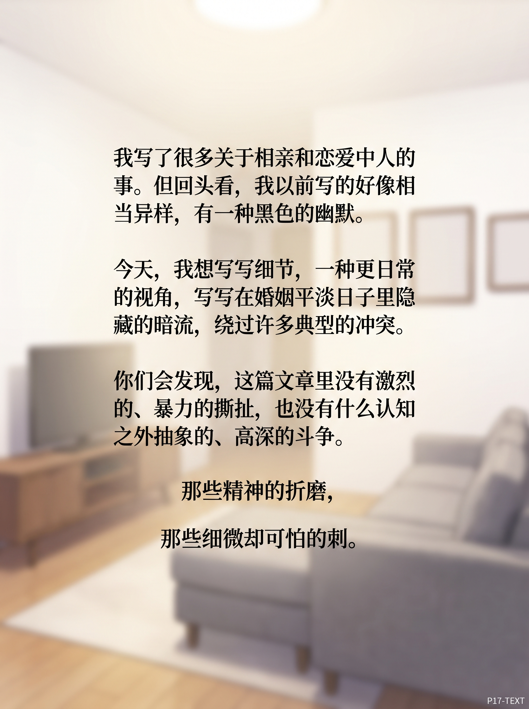

> 我写过很多相亲中的人，爱情中的人。
>
> 但仔细回想，之前写的好的都比较特殊，比较黑色幽默。
>
> 今天这篇我想写点细节，写点生活化的视角，写点绕开很多典型矛盾后，婚姻平淡日子里暗藏的洪流。
>
> 你会发现这段视频里，没有剧烈的争吵，没有暴力的撕扯，没有歇斯底里，没有疯狂。
>
> 也没有任何超越认知的抽象与抗争。
>
> **那些有关精神之间的折磨，才是细小而可怕的刺。**

---

## 第十六幕 · 命名《李斌之死》

视频是老哥来相亲时，主动给我的。李斌叫的人多，所以也干脆没有化名。前妻的部分做了隐私保护处理后，她无私授权给我进行交流与讨论。

今天这篇文章在写之前我拿给他看。他说怎么感觉有点纪录片的味道，这种家庭系列，是不是应该有个名字啊。

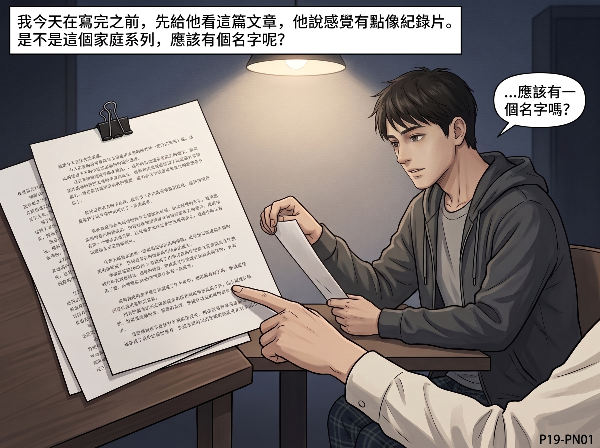

我打趣说，不如就叫《李斌之死》如何——**烛光晚餐映起的余晖是万家灯火，酒瓶砸碎飞溅的酒精也是万家灯火。**

他听了之后有些错愕，紧接着沉默不语。

我觉得有些冒昧，连忙告罪。四下找补说你喜欢什么样的，你车房现在怎么样啊，有意地岔开话题，跟他聊以后相亲的流程事项以及需要对接的手续。

就在我自顾说话间，他忽然紧紧攥着我的手。我不明所以，再看向他时，发现他眼神冷峻，目光如刀一样犀利无比。

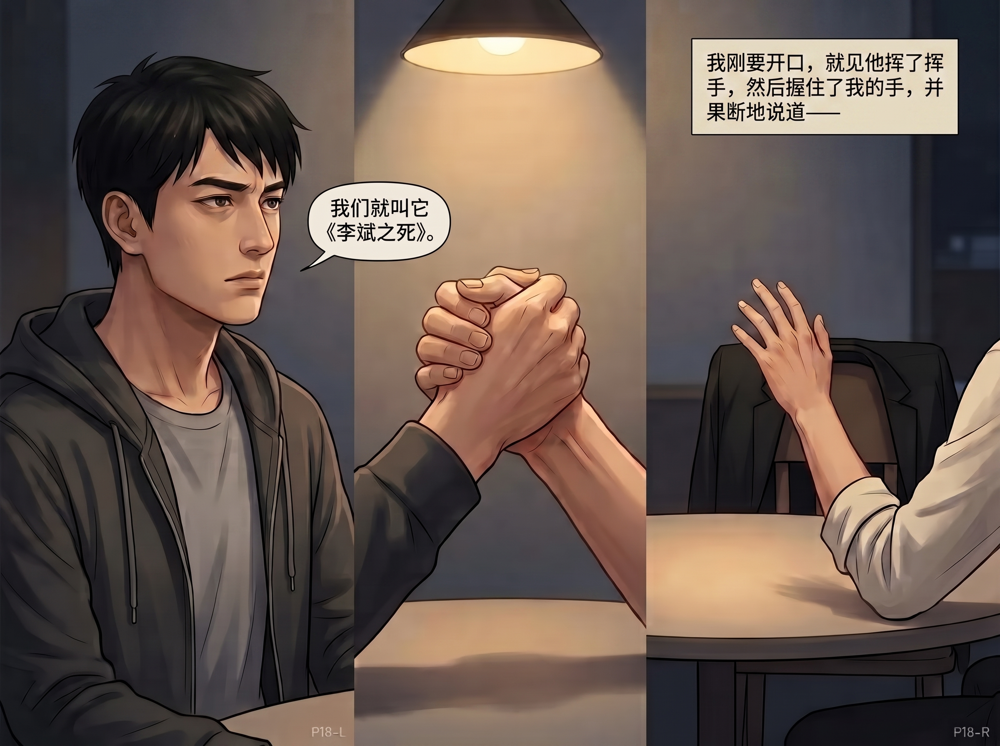

我刚想开口，就见他摆手，随后斩钉截铁道——

> **就叫《李斌之死》。**

---

## 写在最后

视频里的那一天，是李斌婚姻里的最后一天。

没有争吵、没有暴力、没有歇斯底里——只有一次又一次的起床叫喊、一次又一次的快递与榴莲、一次又一次的「别跟我说话」、一次又一次的飞枕。

婚姻的死亡，从来不在剧烈的争吵里。

它藏在妻子第四次推开房门的语气里，藏在李斌沉默擦地板的背影里，藏在两个人坐在一起望向电视却不说话的空隙里。

**它细小、琐碎、平淡到几乎不可见。**

**但每一根刺，都在累积。**

—— MC 鲁迅

---

## 延伸阅读

- 漫画分镜脚本：[`/pages/`](pages/) 与 [`/panels/`](panels/)
- 角色一致性锚点：[`/characters/`](characters/)
- 项目制作 SOP：[`CLAUDE.md`](CLAUDE.md)

> **版权说明**：本文基于离异当事人「李斌」授权素材撰写，前妻部分已做隐私保护处理。当事人姓名、联系方式等敏感信息均已隐去或化名。